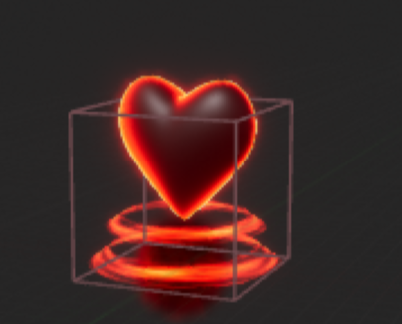

1. Core:
   1. he level should be set from easy to difficult.
   2. Special ability needs to be limited. Because special ability is a mechanism to let level interesting, inspire players to explore, not a trick to avoid difficulties
2. Enemy design
   1. The Pursuer:The enemy can purse player and cause damage when hit players. This enemy can only purse player in a certain range.
   2. The Mortar: Can fire artillery shells to cause damage to players. Players will be knocked away when they encounter shells.This enemy will be fixed on the wall. The wall is higher than flying height to prevent player use fly to avoid shells.
   3. Own Enemy (The laser). This enemy can fire laser within a certain range, causing high damage to the player. Players can use shield to protect themselves.
3. Player design:
   1. Controller: W/A/S/D, up/left/down/right
      1. Q: open/close shield (if have)
      2. Ctrl: crouch
      3. E: manipulate lever
      4. Space: jump (press once); fly (press double)
      5. Mouse: control perspective
   2. Characters can't fly forever. A flight has a duration, after which the character will fall
   3. Ctrl can help player go through narrow space
   4. E can help player manipulate lever and open the door
   5. Shield provide player a method to avoid laser damage. Shield can open/close by Q. Shield also has duration time.
4. Boon:
   1. Shield: provide shield to player 
   2. Heart: provide health 
   3. Gifts: provide score
5. Map design:
   1. Some floating islands and gaps need to be set up to allow the player to take full advantage of their flying abilities
   2. Some special block needs to be set and player can use their special abilities to overcome (such as shield, manipulate lever to open the door)
   3. Health packages set after players defeat enemy, which can help them continue game.
   4. Make full use of the map space and create trails for the player to overcome
